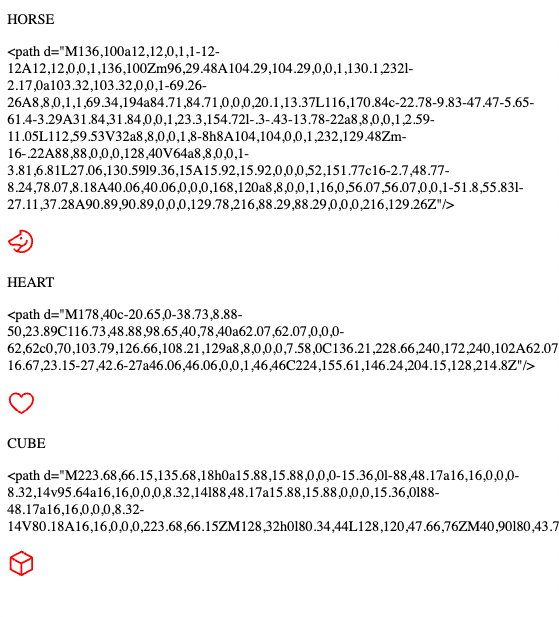

# Playground for phosphor icons

rendering is somehow broken. Data is there, but svg nodes are empty.



## run 

```sh
trunk serve --open
```

## Cargo.toml

The config file also has versions for leptos 0.8 (commented out) where the phosphor-leptos dependency points against my fork of the updated version.
